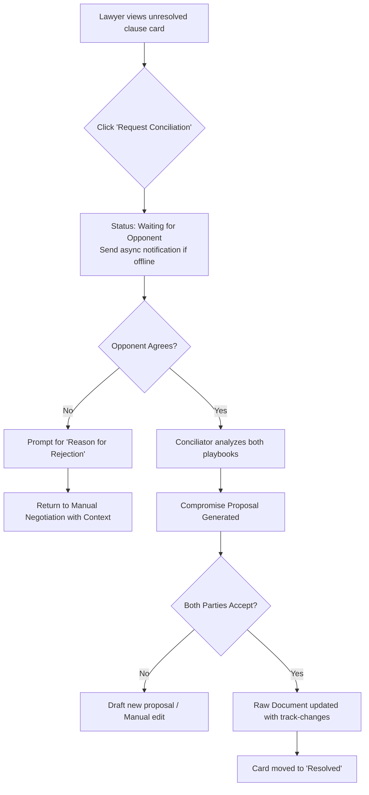
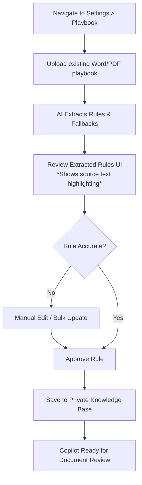
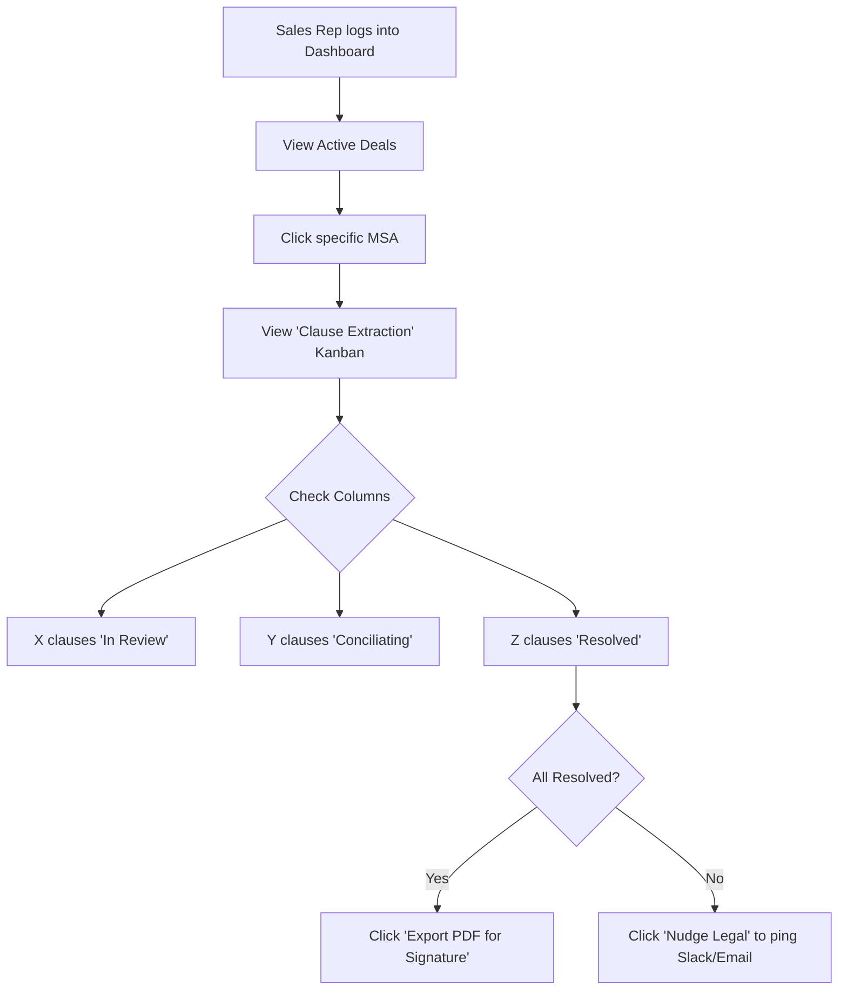

# UX Design Specification NegoContract

**Author:** Maxime
**Date:** 2026-05-09

---

## Executive Summary

### Project Vision

NegoContract is a centralized, dual-sided B2B SaaS platform that transforms contract negotiation. It eliminates the slow email ping-pong of redlines by bringing Vendor and Client lawyers into a shared workspace. Powered by a unique multi-agent AI system, its standout feature is the AI Conciliator—an intelligent mediator that actively resolves clause conflicts by finding optimal, pre-approved middle grounds between two opposing playbooks, drastically accelerating the path to a signed deal.

### Target Users

- **Lawyers (Vendor & Client):** The primary users who need a familiar, Word-like redlining experience combined with powerful AI assistance to speed up routine reviews.
- **Sales Reps & Deal Desk:** Secondary users who need clear, abstracted visibility into the negotiation pipeline without seeing raw legal text.
- **Admins / Managing Partners:** Users who configure and maintain the organization's private playbook rules, fallbacks, and non-negotiables.

### Key Design Challenges

- **Distinguishing AI Personas:** Visually differentiating the actions and suggestions of the Personal AI Copilot from the impartial AI Conciliator so users immediately understand who is proposing what.
- **Minimizing Adoption Friction:** Delivering a UI that feels as intuitive and reliable as traditional Word redlining, avoiding a steep learning curve for opposing counsel.
- **State Management & Locking:** Clearly communicating document states, such as when specific clauses are locked during active AI conciliation, without confusing the users.

### Design Opportunities

- **The Hackathon "Aha!" Moment:** Designing a highly visual and impactful dual-screen interaction flow for the AI Conciliation process that instantly proves the value of the platform.
- **Abstracted Pipeline Visibility:** Creating a clean, Kanban-style dashboard for Sales Reps that translates complex legal redlines into simple, actionable deal stages.

## Core User Experience

### Defining Experience

The core experience of NegoContract revolves around the seamless transition from traditional document redlining to intelligent AI mediation. The defining interaction is the moment a negotiation stalls and the users invoke the AI Conciliator. This turns a complex, multi-round argument into a single-click resolution process, where the platform analyzes both playbooks and proposes an optimal middle ground natively within the document interface. 

To manage this complexity, the platform introduces a **Clause Extraction Panel**, allowing users to effortlessly toggle between viewing the "raw" traditional document and a Kanban-style board that visualizes the contract clause-by-clause (e.g., To Do, In Review, Conciliating, Resolved).

### Platform Strategy

- **Primary Platform:** Desktop Web Application. Contract negotiation requires high-fidelity document interaction, large screens for reviewing long texts, and precise track-changes controls. 
- **Interaction Model:** Mouse and keyboard heavy, mirroring the traditional Microsoft Word experience to minimize adoption friction.
- **Constraints:** Must support real-time concurrent editing and fast synchronization (<500ms latency) to prevent race conditions during live negotiations.

### Effortless Interactions

- **One-Click Conciliation:** Requesting AI mediation for a disputed clause should be as simple as moving a card in the Kanban view or leaving a comment in the raw view.
- **Approving AI Suggestions:** Whether it's the Personal AI Copilot or the impartial Conciliator, reviewing and accepting AI-generated redlines must be an instant, one-click action that immediately updates the document state.
- **State Transitions:** The system should automatically lock clauses during active conciliation and update presence indicators effortlessly across both the raw document and Kanban views without requiring page reloads.

### Critical Success Moments

- **The "Aha!" Resolution:** The exact moment the AI Conciliator proposes a compromise that perfectly satisfies both parties' hidden playbooks, instantly ending a tedious dispute.
- **First-Time User Trust:** When the opposing counsel (who may not be a paid subscriber) opens the platform for the first time and immediately understands how to review redlines and respond to Conciliator prompts without a tutorial.
- **The Sales Dashboard Glance:** When a Sales Rep checks their dashboard and instantly understands the deal's status without needing to interpret complex legal jargon.

### Experience Principles

- **Familiarity Over Novelty:** The core redlining interface must feel like traditional Word, augmented by the Kanban clause-by-clause view for structural management. The AI should feel like a powerful extension, not an alien interface.
- **Absolute Transparency:** Users must always know *who* is acting on the document: themselves, the opposing counsel, their Private Copilot, or the impartial Conciliator.
- **Frictionless Mediation:** Resolving a conflict through the Conciliator must always be faster and easier than drafting an email.
- **Strict Privacy Assurance:** The UI must constantly reinforce that the user's private playbook rules and Copilot suggestions are completely invisible to the opposing side.

## Desired Emotional Response

### Primary Emotional Goals

- **Relief & Empowerment:** Lawyers should feel an immediate sense of relief when the platform automatically resolves a complex multi-round clause dispute, replacing the dread of drafting another argumentative email.
- **Trust & Security:** Users must feel absolute confidence that their private playbook rules and the reasoning of their Personal Copilot are completely hidden from the opposing party.
- **Clarity & Control:** Sales Reps and stakeholders should feel a sense of control and clarity when they look at the pipeline dashboard, replacing the anxiety of the "black box" legal review process.

### Emotional Journey Mapping

- **Discovery/Onboarding:** A feeling of *familiarity*. Opposing counsel opening the app for the first time should feel comfortable because the interface mirrors the standard Word track-changes they already know.
- **Core Action (Redlining):** A feeling of *flow and focus*. The tool gets out of the way, allowing them to edit the document rapidly without lag or distraction.
- **The AI Conciliation:** A moment of *delight and "Aha!"*. The transition from a stubborn impasse to a mutually agreed-upon compromise should feel magical and deeply satisfying.
- **Post-Completion:** A feeling of *accomplishment and speed*, realizing the contract was signed in a fraction of the usual time.

### Micro-Emotions

- **Trust > Skepticism:** AI suggestions (both Copilot and Conciliator) must be presented neutrally and transparently to avoid triggering lawyer skepticism.
- **Clarity > Confusion:** The distinction between human redlines, Private Copilot suggestions, and impartial Conciliator proposals must be instantly clear to avoid any confusion about who is saying what.
- **Accomplishment > Frustration:** Navigating between the raw document and the Kanban clause panel should feel fluid, giving a small dopamine hit as clauses are dragged into "Resolved."

### Design Implications

- **Trust-Building UI:** Use clear color coding and distinct iconography to separate "Your AI" from "Neutral AI." Never take automated action without explicit human approval.
- **Familiarity UI:** Maintain standard legal document conventions (e.g., standard red strikethrough for deletions, blue/green underline for additions, right-hand margin for comments).
- **Delightful Transitions:** Use smooth micro-animations when a clause is resolved via the Conciliator or dragged across the Kanban board to emphasize the feeling of progress.

### Emotional Design Principles

- **Predictability Fosters Trust:** The AI should never surprise the user with unexpected document modifications; it should only ever *propose* and wait for consent.
- **Calmness over Clutter:** The interface should remain clean and minimalist, suppressing non-essential information (like complex playbook rules) until the user explicitly needs it.

## UX Pattern Analysis & Inspiration

### Inspiring Products Analysis

**Microsoft Word / Google Docs:**
- **Core Problem Solved:** Familiar text editing and track-changes for legal documents.
- **Why it Works:** The mental model for document redlining is universally understood (strikethroughs for deletions, underlines for additions, right-margin comments).
- **Inspiration:** We must adopt this visual language for the "raw" document view so lawyers feel instantly at home.

**Linear / Trello:**
- **Core Problem Solved:** Visualizing the state of discrete tasks or components.
- **Why it Works:** Kanban boards provide immediate, high-level clarity on project bottlenecks. Drag-and-drop state changes feel satisfying and effortless.
- **Inspiration:** We will adapt this for the **Clause Extraction Panel**. By treating individual contract clauses as "cards" that move through states (e.g., Unresolved, Conciliating, Agreed), we give Sales and Legal instant pipeline visibility.

**Notion:**
- **Core Problem Solved:** Seamlessly integrating AI (Notion AI) into a minimalist writing environment.
- **Why it Works:** The AI is invoked only when needed via subtle inline menus (e.g., highlighting text and clicking "Ask AI") rather than cluttering the screen with permanent chat windows.
- **Inspiration:** The AI Conciliator and Copilot should be invoked contextually, attached to specific clauses or comments, preserving a calm, uncluttered reading experience.

### Transferable UX Patterns

**Navigation Patterns:**
- **Dual-Pane Layout:** Splitting the screen between the raw document (left) and the Kanban clause panel (right) allows users to maintain context while structurally managing the negotiation.

**Interaction Patterns:**
- **Inline AI Invocation:** Triggering the Conciliator directly from a disputed clause's comment thread, rather than a separate "AI Chat" tab.
- **Kanban Drag-and-Drop:** Allowing users to manually approve an AI suggestion by dragging the clause card from "In Review" to "Resolved."

**Visual Patterns:**
- **Semantic Color Coding:** Using distinct, subdued colors (e.g., blue for Client AI, green for Vendor AI, purple for impartial Conciliator) to clearly delineate the source of automated suggestions without overwhelming the document's primary black-and-white text.

### Anti-Patterns to Avoid

- **The Persistent Chatbot Window:** Having a floating chat widget that obscures document text. This breaks focus and is annoying for deep reading tasks.
- **"Black Box" Auto-Corrections:** Automatically changing text without explicit human approval. In legal tech, the user must always execute the final "Accept" click to maintain trust and liability boundaries.
- **Overwhelming UI Clutter:** Showing all playbook rules, fallbacks, and AI reasoning at all times. This information should be progressively disclosed only when a user clicks to investigate *why* the AI proposed a specific change.

### Design Inspiration Strategy

**What to Adopt:**
- The standard visual language of Word track-changes for the raw document view to ensure zero adoption friction for opposing counsel.
- The Kanban board visualization for managing clause states and providing an abstracted view for Sales Reps.

**What to Adapt:**
- Notion's contextual AI invocation, modified specifically for dual-sided conflict resolution (the Conciliator) requiring two-party consent.

**What to Avoid:**
- Autonomous AI actions that bypass human review, and cluttered, persistent AI chat interfaces that distract from the contract text.

## Design System Foundation

### 1.1 Design System Choice

**shadcn/ui (with Tailwind CSS)**

### Rationale for Selection

- **Development Speed (Hackathon Constraint):** Shadcn/ui provides pre-built, high-quality components that can be immediately dropped into a Next.js 15 project, drastically reducing UI development time.
- **Enterprise Aesthetics:** It defaults to a clean, minimalist, and modern look that perfectly fits a B2B LegalTech SaaS, avoiding the "cookie-cutter" look of older component libraries.
- **Customizability:** Because shadcn/ui components are copied directly into the codebase rather than installed as an opaque package, they offer total control. This is critical for building custom, complex layouts like our dual-pane Kanban and document viewer.
- **Accessibility:** Built on Radix UI primitives, ensuring the platform is fully accessible to enterprise standards out of the box.

### Implementation Approach

- Initialize shadcn/ui within the Next.js App Router environment.
- Establish a global layout featuring a persistent navigation structure and a main content area optimized for the dual-pane workflow.
- Utilize shadcn's complex components (e.g., Dialogs, Popovers, Cards, and Tabs) to rapidly build the Playbook Engine and Clause Extraction Panel.

### Customization Strategy

- **Theming:** Define a subdued, professional color palette using Tailwind (e.g., Slate or Zinc as the base, with highly specific semantic colors for Vendor AI, Client AI, and the Conciliator to distinguish their actions).
- **Typography:** Adopt a highly legible serif font for the "raw document" view to mimic standard legal documents (e.g., Merriweather or Times New Roman), paired with a clean sans-serif (e.g., Inter) for the application UI (Kanban board, dashboards).

## 2. Core User Experience

### 2.1 Defining Experience

The defining experience of NegoContract is the **AI Conciliation Flow**. It is the moment where two opposing lawyers, deadlocked on a specific clause, transition from an adversarial email thread to a collaborative, instantaneous AI-mediated resolution. If we nail the UI for requesting, waiting for, and accepting the Conciliator's middle-ground proposal, we prove the entire value of the platform.

### 2.2 User Mental Model

- **Current Reality:** Lawyers think in terms of "redlines," "track changes," and "margin comments." They expect to read a document linearly and address issues chronologically. 
- **The Shift:** NegoContract introduces a parallel mental model: the contract as a database of distinct clauses (the Kanban panel). 
- **The Bridge:** To prevent confusion, the UI must keep these two models perfectly synchronized. Clicking a clause in the Kanban board must instantly scroll the raw document to that exact paragraph, and vice versa.

### 2.3 Success Criteria

- **Zero-Friction Trigger:** Invoking the Conciliator must be a single, obvious click attached directly to the disputed clause.
- **Clear Dual-Consent:** The UI must effortlessly communicate that the Conciliator is waiting for the *other* party to agree to mediation before it runs.
- **Immediate Clarity of Output:** When the Conciliator returns a proposal, it must clearly display the new text alongside a brief, neutral explanation of *why* this satisfies both playbooks.
- **Effortless Application:** Accepting the proposal must instantly update the raw document with standard track-changes formatting, avoiding any "black box" auto-saving without final human review.

### 2.4 Novel UX Patterns

- **Dual-Sided AI Mediation:** Most LegalTech uses single-sided AI (reviewing against one playbook). Two-sided mediation requires a novel pattern: the "Pending Mutual Consent" state.
- **Pattern Solution:** We will adopt the familiar pattern of a "Friend Request" or "Calendar Invite." When User A requests Conciliation, User B receives an inline notification on that clause: *"Opposing counsel has requested AI Conciliation. [Accept] [Decline]"*.

### 2.5 Experience Mechanics

Let's design the step-by-step flow for the AI Conciliation:

**1. Initiation:**
- A user selects a clause that is currently in a state of conflict (e.g., multiple unresolved comments or redlines).
- They click the prominent "Request AI Conciliation" button on the clause card in the Kanban panel.

**2. Interaction:**
- The clause enters a "Waiting for Opponent" state. The opposing counsel is notified.
- The opposing counsel clicks "Agree to Conciliate."
- The system displays a brief "AI Conciliator is analyzing both playbooks..." loading state (pulsing purple to indicate the neutral AI is working).

**3. Feedback:**
- The Conciliator returns a "Compromise Proposal" card.
- It shows the newly drafted text and a brief rationale (e.g., "This text meets Vendor's requirement for a 30-day notice while satisfying Client's requirement for email notification.").

**4. Completion:**
- Both users independently review the proposal.
- If accepted, the text in the raw document is instantly updated with the new clause, marked as a track-change from "AI Conciliator."
- The clause card moves to "Resolved" in the Kanban board.

## Visual Design Foundation

### Color System

To evoke trust and professionalism while clearly distinguishing AI actors, NegoContract will use a structured semantic color palette built on a neutral foundation:

- **Base/Neutral:** Slate or Zinc (Tailwind defaults) for backgrounds, borders, and general text to reduce eye strain during long reading sessions.
- **Client Actions/AI:** Subtle Blue (`#3B82F6` or `blue-500`). Used for the user's private Copilot suggestions and redlines.
- **Vendor Actions/AI:** Subtle Green (`#10B981` or `emerald-500`). Used for the opposing party's redlines.
- **The AI Conciliator:** Deep Purple/Indigo (`#6366F1` or `indigo-500`). This distinct color signals neutral, third-party mediation, differentiating it entirely from either party's playbooks.
- **Alerts/Warnings:** Standard red (`#EF4444`) used sparingly, primarily for critical errors or hard playbook violations.

### Typography System

The typography must bridge the gap between traditional legal documents and modern SaaS interfaces:

- **Document Text (Serif):** `Merriweather` or `Times New Roman`. The "raw document" view must use a serif font to replicate the mental model of a printed legal contract, maximizing reading comfort for lawyers.
- **Application UI (Sans-Serif):** `Inter` or `Geist`. Used for the Kanban board, menus, buttons, and navigation. It provides clean, high-legibility structure that contrasts with the document text.
- **Scale:** Base size of `16px` for document text for readability. `14px` for UI components to maximize screen real estate.

### Spacing & Layout Foundation

Contract negotiation requires displaying a massive amount of information. The layout must be dense but highly structured to avoid feeling cluttered.

- **Grid System:** An 8px base spacing system (standard Tailwind scale). 
- **Layout Structure:** 
  - **Left Pane (Raw Document):** Fixed width, centered text block with wide margins to mimic a standard A4/Letter page.
  - **Right Pane (Clause Extraction/Kanban):** Fluid width, expanding to fill available space, utilizing dense card layouts with 12px or 16px padding.
- **Z-Index Strategy:** Flat UI design. Drop shadows are reserved exclusively for active, floating elements (like a Conciliator proposal popover) to maintain focus on the text.

### Accessibility Considerations

- **Contrast Ratios:** All document text must meet WCAG AAA (7:1) contrast ratios against the background to prevent eye strain during long review sessions.
- **Color Independence:** Color coding for AI actors (Blue/Green/Purple) must always be accompanied by clear iconography or text labels (e.g., a "Conciliator" badge) so the interface remains usable for color-blind users.
- **Keyboard Navigation:** The dual-pane view must support complete keyboard navigation, allowing lawyers to tab through unresolved clauses without reaching for the mouse.

## Design Direction Decision

### Design Directions Explored

We explored approaches balancing the strict, text-heavy nature of legal documents with the modern, component-driven nature of task management. The explorations varied from highly integrated (where Kanban cards floated over the text) to strictly separated dual-pane layouts.

### Chosen Direction

**The Strict Dual-Pane Layout** (as demonstrated in the generated HTML mockup).
- The left pane operates entirely as a traditional document viewer (Serif typography, A4 page margins, standard Word-like track changes).
- The right pane operates entirely as a modern SaaS task manager (Sans-serif typography, dense card UI, distinct Kanban columns).

### Design Rationale

This direction was chosen because it perfectly supports the dual mental models required for this product. Lawyers can focus solely on the left pane to read the document chronologically without SaaS UI cluttering their view, while Sales Reps or project managers can focus on the right pane to see the status of the deal. Keeping them side-by-side but visually distinct prevents cognitive overload and reinforces trust.

### Implementation Approach

- Use a strict CSS Grid or Flexbox layout that prevents the document text from wrapping awkwardly on smaller desktop screens.
- **Visual Calmness:** Minimize borders in the Kanban panel, relying on subtle background color shifts to prevent the UI from visually competing with the heavy text document.
- **Performance:** Implement virtualized lists to handle the synchronized scrolling between the raw document text and the React state-driven Kanban cards, ensuring high performance even with 50+ page contracts.
- **Conversion/Actions:** Ensure a prominent, persistent "Export Contract" action remains visible in the top navigation at all times so Sales Reps can immediately retrieve the final PDF when all clauses are resolved.
- Ensure the "Request AI Conciliation" button is the primary call-to-action on unresolved clause cards to drive users toward the core experience.

## User Journey Flows

### 1. The Clause Conciliation Flow

This is the primary mechanic of NegoContract, where two parties resolve a disputed clause without drafting argumentative emails.

### 2. Playbook Ingestion Flow

The onboarding process where a lawyer uploads their firm's standard positions so their Private Copilot can assist them.

### 3. Sales Pipeline Visibility Flow

How a Sales Rep checks the status of a contract without interrupting the legal team.

### Journey Patterns

Across these flows, we can standardize the following patterns:
- **Dual-Consent Authorization:** Any action that alters the shared state of the contract (like Conciliation) strictly requires explicit approval from both Actor A and Actor B.
- **AI as a Proposer, Not an Executor:** The AI (whether the Copilot or the Conciliator) never saves changes directly to the raw document. It generates a "Proposal Card" that humans must explicitly click "Accept" on.
- **State-Driven Visibility:** Sales Reps do not read the contract; they read the *state* of the contract (the Kanban columns). All legal actions automatically update this state.

### Flow Optimization Principles

- **Minimize Context Switching:** The dual-pane layout ensures that when a lawyer clicks a clause in the Kanban board, the raw document instantly scrolls to it, preventing them from losing their place.
- **Graceful Degradation:** If the Conciliator fails to find a compromise, or if a party rejects it, the system smoothly falls back to standard comment-based manual negotiation. No dead ends.
- **Extraction Trust (New):** AI extraction of playbook rules must explicitly link back to the source text, building user confidence through transparency.

## Component Strategy

### Design System Components

Based on our choice of `shadcn/ui`, we have a robust foundation of primitive components. We will rely heavily on:
- **Cards & Badges:** For the structural foundation of the Kanban board.
- **ScrollArea:** To handle the independent, virtualized scrolling of both panes.
- **Dialogs & Popovers:** For the Playbook Ingestion review flow and inline actions.
- **Tabs:** To switch views in the Sales Dashboard.

### Custom Components

While `shadcn/ui` provides the primitives, the core experience relies on highly specific composite components that we must build from scratch:

### 1. ClauseCard

**Purpose:** Represents a single extracted clause in the Kanban panel, showing its current negotiation state.
**Anatomy:** 
- Header (Clause ID and State Badge).
- Body (Summary of the conflict, e.g., "Vendor wants 30 days, you want 90").
- Footer (Primary action button, e.g., "Request AI Conciliation").
**States:** Default, Hover (highlights corresponding text in raw document), Active (selected), Dragging.
**Interaction Behavior:** Clicking the card scrolls the left pane to the exact paragraph. Dragging the card updates its state.

### 2. ConciliatorProposal

**Purpose:** Displays the AI-generated compromise text and gathers dual-consent.
**Anatomy:** 
- "Neutral AI" visual indicator (Purple/Indigo styling).
- Diff view (showing what will be inserted/deleted).
- Rationale block (briefly explaining why it satisfies both playbooks).
- Dual-action footer ("Accept" / "Reject & Provide Reason").
**States:** Waiting for Opponent, Reviewing Proposal, Accepted, Rejected.

### 3. SynchronizedDocumentViewer

**Purpose:** Renders the raw contract text with inline track-changes and handles scroll-syncing.
**Anatomy:** 
- Clean, serif-typography text block.
- Absolute-positioned highlight anchors for extracted clauses.
**Interaction Behavior:** Must expose an API to accept scroll events from the Kanban board and dispatch scroll events when the user scrolls the document manually.

### Component Implementation Strategy

- **Build on Primitives:** All custom components will use `shadcn/ui` primitives (e.g., `ClauseCard` will extend `Card`). This ensures accessibility (ARIA labels, keyboard navigation) is inherited automatically.
- **State Management:** Custom components will be purely presentational where possible, relying on a global state manager (e.g., Zustand) to handle the complex synchronization between the Document Viewer and the Kanban Board.

### Implementation Roadmap

**Phase 1 - Core Components (The Hackathon MVP):**
- `SynchronizedDocumentViewer`
- `ClauseCard` (Basic states: In Review, Resolved)

**Phase 2 - The Conciliator Engine:**
- `ConciliatorProposal` (incorporating the async "Waiting for Opponent" states)

**Phase 3 - Playbook & Pipeline:**
- `PlaybookExtractionReview` (Bulk editing UI for ingested rules)
- `SalesPipelineDashboard` (High-level deal state visualization)

## UX Consistency Patterns

### Button Hierarchy

- **Primary Actions (Solid Fill):** Reserved strictly for advancing the core workflow (e.g., "Request AI Conciliation," "Accept Proposal," "Export Contract"). Use the semantic color corresponding to the action.
- **Secondary Actions (Outline/Ghost):** Used for manual interventions or local actions (e.g., "Add Manual Comment").
- **Destructive/Terminal Actions (Red Outline/Ghost):** Used when declining an AI proposal.

### Feedback Patterns

- **Asynchronous Updates (Toasts):** Because conciliation is a dual-consent process, users need to know when the opposing counsel acts. We will use non-intrusive bottom-right Toast notifications. *Technical Note: This requires real-time infrastructure (WebSockets/SSE).*
- **AI Processing (Inline Loading):** Instead of full-screen spinners, only the specific Clause Card and the corresponding document paragraph will show a subtle pulsing "skeleton" when the Conciliator is thinking, preserving the reading flow.
- **Forgiving Actions (Undo Window):** Any action that legally modifies the contract (like accepting an AI proposal) must immediately trigger a 5-second "Undo" toast to prevent accidental commitments.

### Form Patterns

- **Auto-Save with Undo:** For the Playbook Ingestion flow, inline edits to extracted rules should auto-save on blur to maximize speed, utilizing an optimistic UI pattern.
- **Structured Inputs for Rejections:** When rejecting a Conciliator proposal, the form must provide quick-select chips for common reasons (e.g., "Violates Liability Cap"). This is critical not just for UX, but for feeding clean, structured constraints back into the AI for its next generation attempt.

### Navigation Patterns

- **Synchronized Dual-Pane Navigation:** The primary navigation method through the document is the Kanban board. Clicking a card smoothly scrolls the document pane to the anchor.
- **Global Actions (Top Nav):** The top navigation bar is reserved for document-level metadata and terminal actions.

### Additional Patterns

- **The "Pending Mutual Consent" State:** Any clause card waiting on the other party is visually muted and features a distinct "Waiting" icon to prevent the user from feeling stuck while waiting for asynchronous input.

## Responsive Design & Accessibility

### Responsive Strategy

NegoContract is fundamentally a **desktop-first** application because legal contract review is a heavy, cognitively demanding task that lawyers almost exclusively perform on large external monitors or laptops. However, the Sales Pipeline Visibility flow requires a solid mobile experience.

- **Desktop (Primary):** The strict dual-pane layout shines here. The left pane takes ~60% (raw document), and the right pane takes ~40% (Kanban board).
- **Tablet (Secondary):** The dual-pane approach is modified. The document takes full width, and the Kanban board collapses into an off-canvas drawer that can be toggled on and off, ensuring the document remains readable.
- **Mobile (Sales & Read-Only):** The dual-pane layout is abandoned. Mobile users default to the Kanban view (so Sales Reps can check deal status instantly). Tapping a card opens a bottom sheet overlay to read specific clause texts.

### Breakpoint Strategy

We will use Tailwind's default breakpoints, focusing on specific layout shifts:
- **`md` (768px):** Transition from the mobile Kanban-only view to the Tablet drawer-based layout.
- **`lg` (1024px):** Transition to the full, strict dual-pane layout.

### Accessibility Strategy

Given the enterprise legal nature of the product, **WCAG 2.1 Level AA** is the mandatory baseline, with a specific focus on:
- **Color Independence:** The semantic colors (Client Blue, Vendor Green, AI Purple) must never be the sole indicator of state. State badges must contain explicit text or distinct icons to support color-blind users.
- **Keyboard Navigation:** Lawyers heavily rely on keyboard shortcuts. The entire dual-pane view must be navigable via `Tab` (moving between clauses) and `Enter` (opening/activating a clause).
- **Contrast Ratios:** The document viewer must maintain extremely high contrast (minimum 4.5:1, targeting 7:1 for core text) to prevent eye strain during long, multi-hour review sessions.

### Testing Strategy

- **Keyboard Audits:** Manual testing to ensure a user can request conciliation and accept an AI proposal without ever touching the mouse.
- **Screen Reader Compatibility:** Validate that the synchronized scrolling doesn't confuse screen readers (e.g., ensuring `aria-live` regions announce state changes gracefully without reading the entire document again).

### Implementation Guidelines

- **Primitives:** Rely on `shadcn/ui` components, as they are built on Radix UI primitives that handle ARIA roles and focus management out-of-the-box.
- **Typography:** Use `rem` for typography in the document viewer to strictly respect user browser font-size settings.
- **Scroll Sync Safety:** Ensure the synchronized scrolling logic detaches or behaves safely when screen readers are active to prevent focus stealing.
